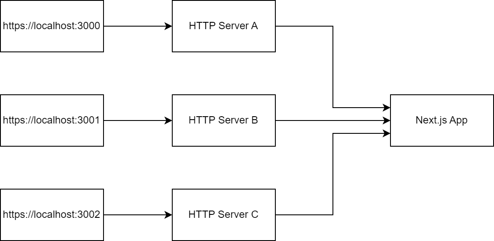

# Next.js several custom servers issue

Next.js allows to create a custom HTTP server and forward request from it to Next.js app. 

In my case I need to create several HTTP servers and forward requests from it to the same Next.js app. I need it for multi-brand (white-list) app development.

But in case if I create several HTTP servers "Fast refresh" feature of Next.js works only for pages of first opened host. I added a little changes to Next.js to handle my case.  

This project was bootstrapped with [Create Next App](https://github.com/segmentio/create-next-app).

